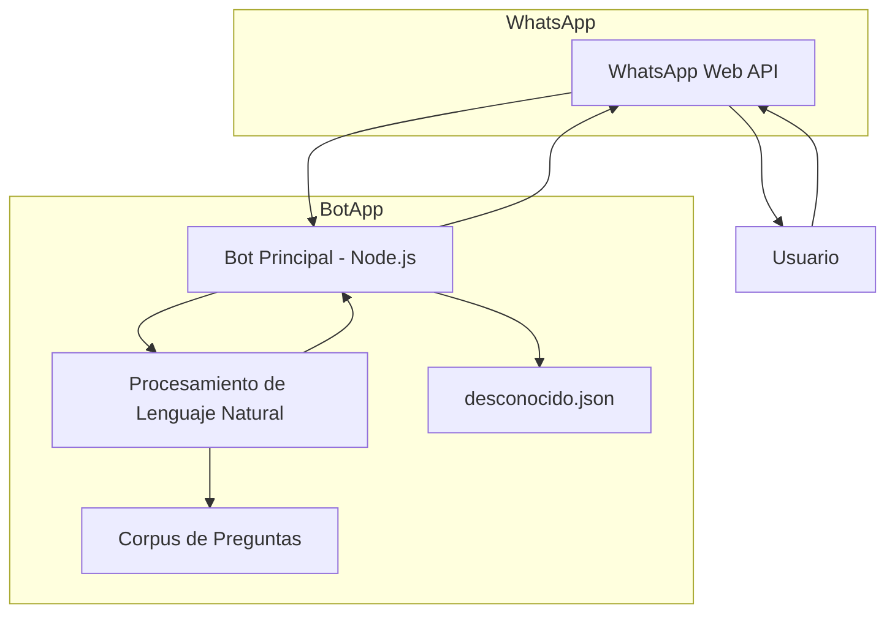

# 🎮 GameZoneBot — Chatbot Comercial para WhatsApp

**GameZoneBot** es un asistente virtual inteligente diseñado para automatizar la atención al cliente en la tienda de videojuegos **GameZone**. Utiliza técnicas de procesamiento de lenguaje natural (PLN) para comprender y responder de forma eficaz a las consultas de los usuarios.

---

## 🔧 Funcionalidades Destacadas

- 📌 **Respuestas semánticas** mediante similitud Jaro-Winkler  
- 🧠 **Clasificación automática** de intenciones: diálogo, información, videojuegos  
- 🗃️ **Corpus modular** categorizado temáticamente  
- 🧾 **Registro de preguntas desconocidas** para entrenamiento futuro  
- 🖼️ **Imagen de bienvenida** automática  
- 💬 **Integración con WhatsApp Web** sin uso de APIs externas  

---

## 🔁 Proceso de Funcionamiento

1. **Recepción del mensaje** desde WhatsApp vía `whatsapp-web.js`
2. **Preprocesamiento** del texto: limpieza, conversión a minúsculas y normalización de acentos
3. **Cálculo de similitud** semántica usando Jaro-Winkler (umbral ≥ 0.74)
4. **Identificación de intención** (diálogo, información, juegos)
5. **Generación de respuesta personalizada**
6. **Registro automático** de preguntas no reconocidas en archivo local

---

# 📦 Estructura del Proyecto

```
   gamezone-bot/
├── 📄 .DS_Store # Archivo de configuración de macOS (puede ignorarse)
├── 📂 corpus/ # Directorio de intenciones/respuestas del bot
│ └── 📄 corpus.js # Base de conocimiento con preguntas y respuestas organizadas
├── 📄 desconocido.json # Registro de preguntas no reconocidas (para mejora continua)
├── 📄 index.js # Lógica principal del bot
├── 📄 logo.png # Imagen de bienvenida/identidad visual
├── 📄 numeros.js # Lista de números autorizados (control de acceso)
├── 📄 package.json # Configuración del proyecto y dependencias
├── 📄 package-lock.json # Bloqueo de versiones de dependencias
└── 📄 README.md # Documentación principal del proyecto

```


---

## 🛠️ Arquitectura Técnica

### Diagrama de Componentes



---

#🚀 Instalación y Configuración

-git clone https://github.com/tuusuario/gamezone-bot.git
cd gamezone-bot

-npm install

-npm start

## 🛠️ Dependencias Principales

| Paquete            | Función                                     |
|--------------------|---------------------------------------------|
| `whatsapp-web.js`  | Conexión con WhatsApp Web                   |
| `natural`          | Similitud de texto con Jaro-Winkler         |
| `fs` / `fs-extra`  | Lectura y escritura de archivos locales     |
| `qrcode-terminal`  | Muestra el QR en consola                    |

---

## 📌 Requisitos del Sistema

- ✅ Node.js v16 o superior  
- ✅ NPM v8 o superior  
- ✅ WhatsApp activo en un teléfono móvil  
- ✅ Navegador Chromium instalado  

---

## 💬 Ejemplos de preguntas reconocidas

**🎧 Diálogo**
- Hola
- Gracias
- Buenas tardes

**🏬 Información**
- ¿Dónde están ubicados?
- ¿Tienen servicio de envío?
- ¿Cuáles son los horarios?

**🎮 Juegos**
- ¿Qué videojuego me recomiendas?
- ¿Tienen juegos de carreras?
- ¿Venden videojuegos usados?

---

## 📚 Entrenamiento y Corpus

El archivo `corpus.js` contiene más de **60 preguntas** categorizadas en:
- Diálogo
- Información
- Videojuegos

Además, las preguntas sin coincidencias se almacenan automáticamente en `desconocido.json` para analizarlas y enriquecer el corpus con nuevas entradas.

---


